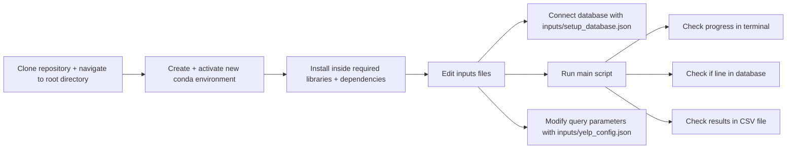

# **_Yelp Scraper_**

This is a simple scraper for the French website "**_yelp_**". It is written in Python and uses the `scrapling`
library to bypass the Cloudflare protection.
> Don't forget that search parameters can be modified in the `inputs/yelp_config.json` file.

## License
This project is licensed under the [GNU Affero General Public License v3.0](https://www.gnu.org/licenses/agpl-3.0.html).  
- You are free to use, modify, and distribute the code, but **commercial use is prohibited without explicit permission**.  
- Any significant modifications or derived works must credit the original author, **[Votre Nom]**, and must also be distributed under the same license.


# Prerequisites:

#### **Before the first step, be sure to have installed `pip`, the `conda` package manager and `git` on your machine !**

### Link to the official documentation for the installation of these tools:

- [Pip](https://pip.pypa.io/en/stable/installation/) (should be installed by default with Python)
- [Miniconda](https://docs.conda.io/en/latest/miniconda.html) (for package management)
- [Git](https://git-scm.com/book/en/v2/Getting-Started-Installing-Git) (for version control)

# Installation :

## 1. Clone this repository to your local machine within the terminal:

```bash
  git clone https://github.com/jnoundu89/YelpScraper.git
```

## 2. Navigate to the root directory of the project:

```bash
  cd YelpScraper
```

## 3. Install the required libraries in a new conda environment:

```bash
  conda create --name *env_name* python=3.12
```

```bash
  conda activate *env_name*
```

* Be sure to replace `env_name` with the name you want to give to the environment.
  Then, install the required libraries in the new conda environment:

```bash
  pip install -r requirements.txt
```

* Then you launch the installation of all inside dependencies:

```bash
  scrapling install
```

## 4. Edit the configuration files in the `inputs/` folder.

* First, rename the file `inputs/yelp_config[DON'T FORGET TO RENAME].json` to `inputs/yelp_config.json`
  and fill it with the search parameters you want to use like :

```json
{
  "params": {
    "find_desc": "Restaurants",
    "find_loc": "Lyon"
  }
}
```

* Then, rename the file `inputs/setup_database[DON'T FORGET TO RENAME].json` to `inputs/setup_database.json` and fill it
  with the database credentials you want to use like :

```json
{
  "engine": "mysql",
  "hostname": "127.0.0.1",
  "username": "root",
  "password": "root",
  "port": "3306",
  "schema": "yelp"
}
```

> In progress : if you want to use postgresql, you can change the `engine` value to `postgresql`.

## 5. Run the main script with the conda environment activated:

```bash
  python main.py
```

/!\ There is two optional arguments that you can use :
- `--no-database` : to not save the data in the database you have set up in the `inputs/setup_database.json` file
- `--no-csv` : to not save the data in a CSV file in the `outputs/` directory

```bash
  python main.py --no-database --no-csv
```

## 6. Check the results:

> Results will be saved in a CSV file in the newly created `outputs` directory, with the name containing the search
> parameters, plus the current formatted date, i.e. `restaurants_lyon_DD_MM_YYYY.csv`.

> It will also save line by line each row in the database that you have set up with the credentials in
`"inputs/setup_database.json"` file.

> Don't forget to check the logs in your terminal or in the `logs/` directory to see if the scraper has run
> successfully !

## More information:

* If you want to update all the pip packages (because of an update of the scraper for example), you can run the
  following command after activating the conda environment:

```bash
    pip install --upgrade -r requirements.txt
```

* If you want to have the last up-to-date version of this repository, don't forget to run the following command :

```bash
    git pull
```

# Directory structure:
```bash
└── jnoundu89-yelpscraper/
    ├── README.md
    ├── LICENSE
    ├── main.py
    ├── requirements.txt
    ├── scraper.py
    ├── data_processing/
    │   ├── data_processing.py
    │   └── models/
    │       └── business_model.py
    ├── database/
    │   ├── database_engine.py
    │   ├── generate_orm_tables.py
    │   └── sql_requests.py
    ├── inputs/
    │   ├── setup_database.json
    │   └── yelp_config.json
    ├── pages/
    │   └── yelp.py
    └── utilities/
        ├── config_loader.py
        ├── helper.py
        ├── logging_util.py
        └── request_utils.py
```


# Diagram to summarize the steps:

